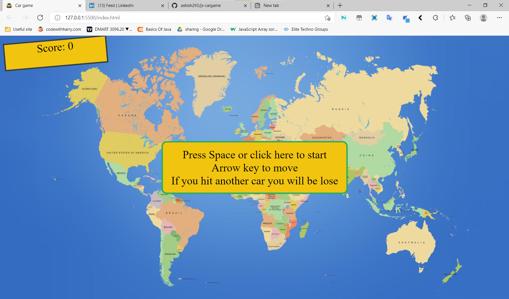
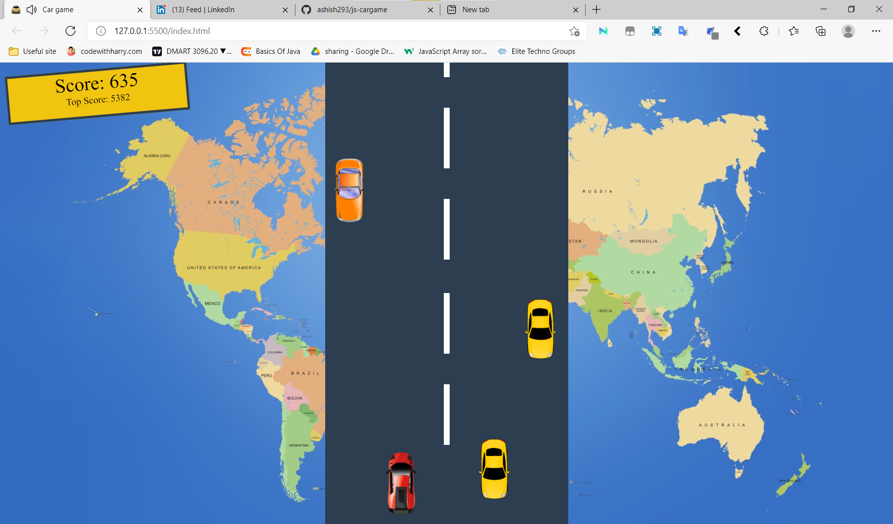

# Car game using Javascript

## Introduction

This is a car racing game project. For this I used HTML/CSS/JS.  
  

## Feature

- Arrow key to move the car.
- It saves your high score.
- On hit others car, you will lose the game.
- Added Sound

## Links

Deployment- <a href="https://ashish293.github.io/js-cargame/">here</a>
